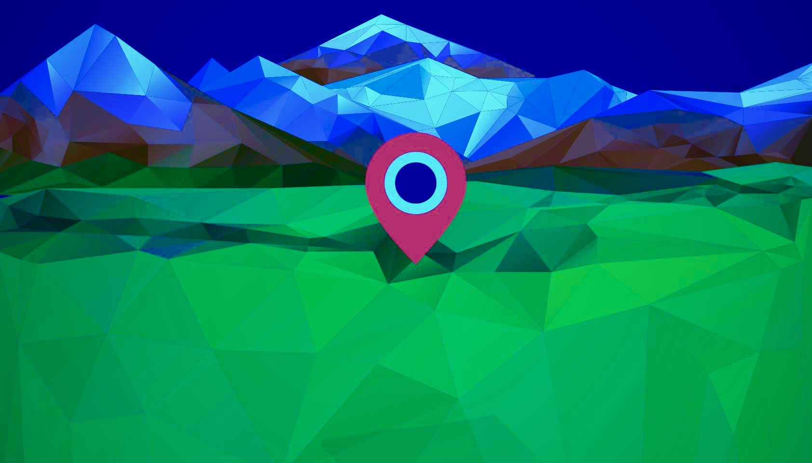

# IP Geo Locator


[](https://goreportcard.com/report/github.com/gkarthiks/ip-geo-locator)




Locates the geography of the given IP address. The webserver continiously runs on port 8080 and accepts the `GET` request on the following  endpoint `http://<server-address>:8080/ip/<comma_separated_IP_addresses>`

Requests to the above endpoint will be responded with the user friendly JSON responses as shown below.

```json
{
  "Responses": [
    {
      "ip": "218.189.35.128",
      "host": "218.189.35.128",
      "isp": "HGC",
      "city": "",
      "countrycode": "HK",
      "countryname": "Hong Kong",
      "latitude": "22.25",
      "longitude": "114.1667"
    }
  ]
}
```

As explained earlier, the server also accepts the comma separated IP address and will respond with array of JSON objects as shown below.

#### Comma separated multiple IP Addresses
```url
http://localhost:8080/ip/218.189.35.128,118.189.35.128,18.189.35.128
```

#### JSON Response
```json
{
  "Responses": [
    {
      "ip": "218.189.35.128",
      "host": "218.189.35.128",
      "isp": "HGC",
      "city": "",
      "countrycode": "HK",
      "countryname": "Hong Kong",
      "latitude": "22.25",
      "longitude": "114.1667"
    },
    {
      "ip": "118.189.35.128",
      "host": "118.189.35.128",
      "isp": "M1 Connect Pte Ltd",
      "city": "Singapore",
      "countrycode": "SG",
      "countryname": "Singapore",
      "latitude": "1.2929",
      "longitude": "103.8547"
    },
    {
      "ip": "18.189.35.128",
      "host": "18.189.35.128",
      "isp": "Amazon.com",
      "city": "Columbus",
      "countrycode": "US",
      "countryname": "United States",
      "latitude": "39.9653",
      "longitude": "-83.0235"
    }
  ]
}
```

### Docker Image
This utility project is dockerized and is avilable as a docker image [here](https://hub.docker.com/r/gkarthics/ip-geo-locator).
